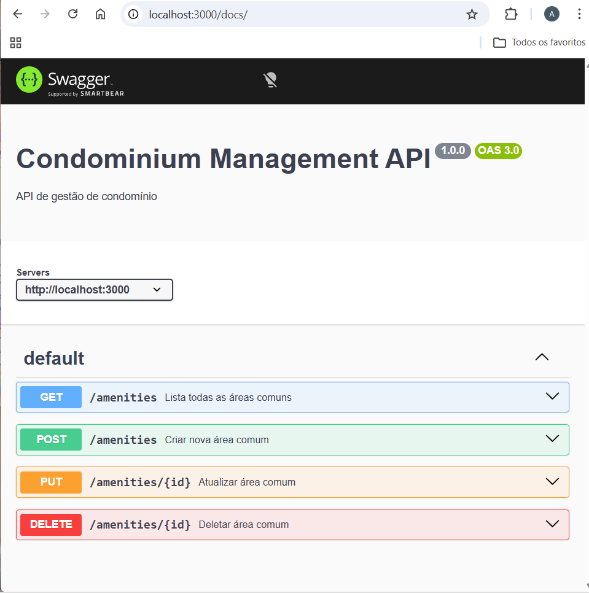

# 🏢 Condominium Management API

API REST completa para gestão de condomínios com Node.js, PostgreSQL, Prisma e Swagger.

## 🚀 Tecnologias

- Node.js
- Express
- PostgreSQL
- Prisma ORM
- Swagger

## 📌 Funcionalidades

- Cadastro de usuários
- Gestão de áreas comuns (amenities)
- Sistema de reservas
- Integração entre módulos

## 📸 Demonstração

